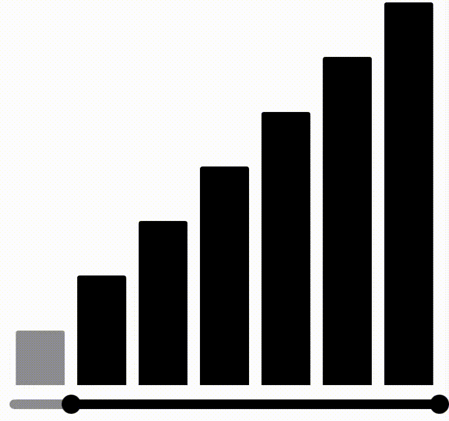
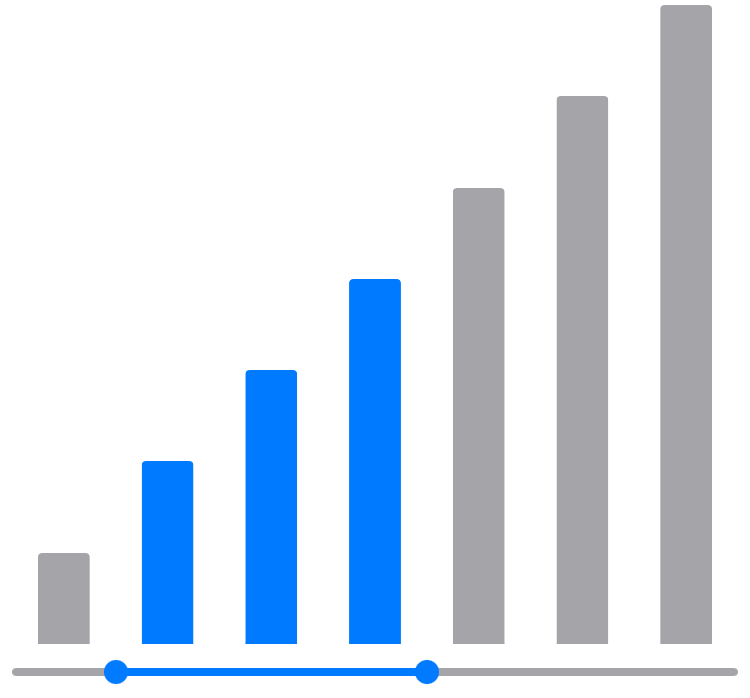

# GraphRangeSlider

[](https://github.com/apple/swift-package-manager)
[](https://opensource.org/licenses/MIT)

The **GraphRangeSlider** is a SwiftUI native component that displays a graph while allowing you to select a range with a RangeSlider. It utilizes SwiftCharts for graph visualization and can be customized to match various styles.




## Usage

### Initialization

To build the view, you need to create a model that conforms to `GraphRangeElement`. In this protocol, `x` will be used to represent the values on the horizontal axis of the graph, while `y` will represent the values on the vertical axis.

```swift
struct Element: GraphRangeElement {
    let x: Int
    let y: Int
}
```

Once you have prepared the data, you will pass it to the `GraphRangeSlider` along with a KeyPath to distinguish the graph's id and a Binding object to monitor the selected data. In that case, if the element conforms to `Identifiable`, you do not need to pass the id.


```swift
struct ContentView: View {
    let data: [Element] = [
        .init(x: 10, y: 10),
        .init(x: 20, y: 20),
        ...
    ]

    @State var selectedData = [Element]()

    var body: some View {
        GraphRangeSlider(
            data,
            id: \.x,
            selectedData: $selectedData
        )
    }
}
```


### UI Customization
- Width of the bar graph

You can set the dimension of the graph.
This setting value is equivalent to the `MarkDimension` on SwiftCharts.
```swift
.graph(width: .ratio(0.5), height: .automatic)
```

- Inactive color

You can set the colors for the graph and slider when they are out of range.
```swift
.inactiveColor(Color.gray.opacity(0.8))
```

- Active color

You can set the colors for the graph and slider when they are within range.
```swift
.activeColor(Color.blue)
```

- Toggle radius

You can set the radius of the slider's toggle.
```swift
.slider(toggleRadius: 6)
```

- Height of the slider

You can set the height of the slider's track.
```swift
.slider(barHeight: 4)
```

- Slider and graph margin

You can set the margin for slider and graph.
```swift
.margin(4)
```

- Delegate functions

Called when the slider range changes.
```swift
.onChanged { data in
  // handler
}
```
Called when the drag ends.
```swift
.onEnded { data in
  // handler
}
```



## Requirements
- Swift 6.0
- Xcode 16.0
- iOS 16.0
- macOS 13

## Installation

### Xcode
Xcode Toolbar Menu > `File` > `Swift Packages` > `Add Package Dependency`
```
https://github.com/tomosaaan/GraphRangeSlider.git
```

### Swift Package Manager
```
.package(url: "https://github.com/tomosaaan/GraphRangeSlider.git"),

```
